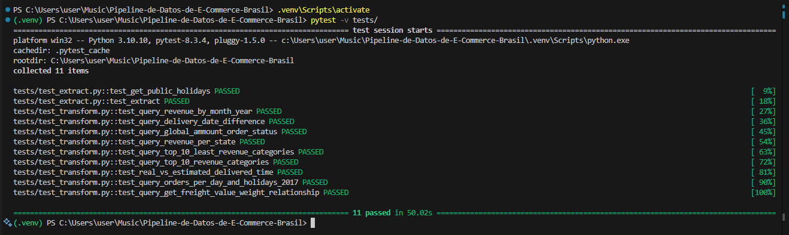
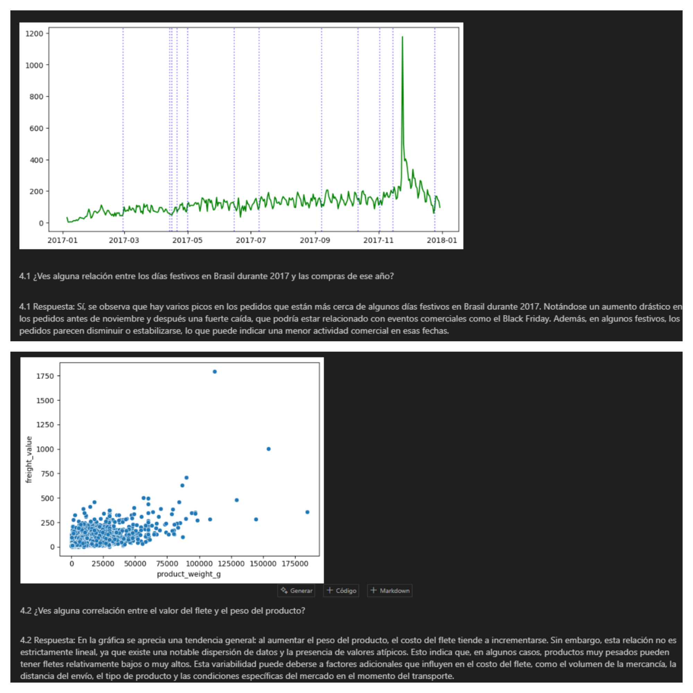
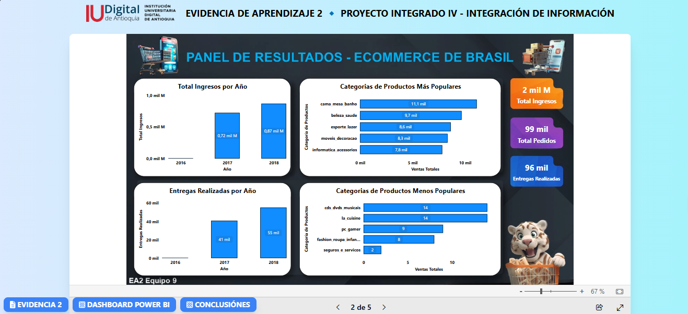
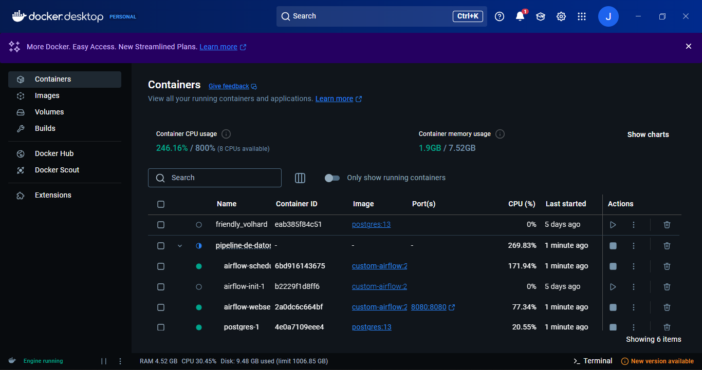
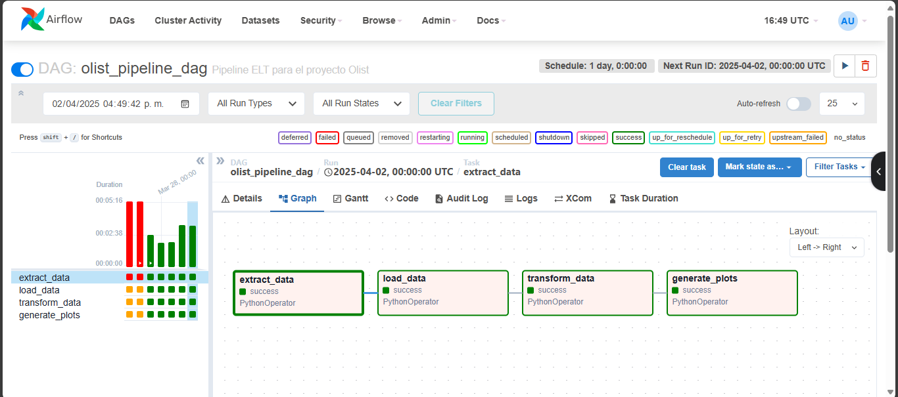

# 🚀 Proceso de Configuración, Validación y Ejecución del Proyecto  


💡 En este documento se detalla el paso a paso para la configuración del entorno, instalación de dependencias, validación y ejecución del flujo de trabajo.  

---

## ⚙️ Configuración del Entorno Virtual  

Para aislar las dependencias del proyecto, se crea un entorno virtual con **venv**:  

```console
py -m venv venv
```

🔹 **Activamos el entorno virtual** con el siguiente comando:  

```console
venv\Scripts\activate
```

📌 **Versión de Python utilizada:** **Python 3.10.10**  

---

## 📦 Instalación y Actualización de Dependencias  

📥 Instalamos todas las dependencias necesarias desde `requirements.txt`:  

```console
pip install -r requirements.txt
```

📢 **Actualizamos pip** a la última versión disponible:  

```console
python.exe -m pip install --upgrade pip
```

📜 **Guardamos la lista de librerías instaladas** en `requirements.txt`:  

```console
pip freeze > requirements.txt
```

---

# 📸 Evidencias del Proceso  

## ✅ 1. Validación del Test de Extracción y Transformacion
🔍 Se valida la correcta extracción y transformacion de los datos para asegurar que se obtienen correctamente.  
  

---

## 📂 2. Ejecución del Archivo de Extracción  
⚡ Se ejecuta el archivo de extracción para verificar su correcto funcionamiento. Se muestran mensajes de éxito ✅ o error ❌ según corresponda.  
  

---

## 🔄 3. Confirmación de la Ejecución de Carga   
📊 Se verifica que la ejecución de la carga se haya realizado correctamente mostrando mensajes de validación y resultados completos.  
  

---

## 🖥 4. Implementación de Script Adicional  
📜 Se implementa un script adicional para gestionar el flujo de trabajo mediante **GitHub Actions**, garantizando la automatización.  
  

---

## 🏗 5. Creación de la Base de Datos del Data Warehouse  
🛢 Se genera la base de datos del **Data Warehouse**, permitiendo almacenar y gestionar la información procesada de manera eficiente.  
  

---

## 📊 6. Visualización de Tablas en SQLite  
🔎 Se listan y verifican las tablas utilizando **SQLite**, asegurando que la estructura de los datos sea correcta.  
  

---

## 7. Ejecución Integral y Validación del Notebook del Proyecto
📓 Se ejecuta todo lo del archivo **Project.ipynb** para validar de manera completa el flujo de trabajo.  
🔍 En este notebook se integran y ponen a prueba todas las etapas: extracción, carga transformación y verificación de la base de datos, gráficos, visualizaciones, entre otras.  
✅ Se comprueba que cada proceso se ejecute correctamente y que genere los resultados esperados.


---

## ✅ 8. Creación del Dashboard en Power BI  
📊 Se crea un dashboard en **Power BI** que consolida los insights de los datos analizados (2016-2018) para abordar el problema de negocio.  
🔍 Se visualizan ingresos anuales, categorías de productos, ingresos por estado, tiempos de entrega y la diferencia entre la fecha estimada y la real, entre otros análisis adicionales.  
🔗 [Accede a la Página EA2 Completa]()  


---

## ✅ 9. Creación de una Página Web Orquestando la Actividad 2
🌐 Se desarrolla una página web sencilla donde se orquestan la EA1 y la EA2, proporcionando un acceso centralizado a los diferentes análisis y evidencias del proyecto. La página incluye el dashboard interactivo, conclusiones con Power BI Access, y enlaces para descargar la carpeta comprimida de la EA2 y descargar el dashboard.
🔗 [Accede a la Página EA2 Completa]() 

---

## ✅ 10. Validación del Flujo de Trabajo en GitHub Actions  
🚀 Se comprueba que el flujo de trabajo en **GitHub Actions** se ejecutó exitosamente, garantizando la automatización total del proceso.  
  

---

## ✅ 11. Verificación de Contenedores en Ejecución  
🛠 Se inicia el entorno con **Docker Compose** y se verifica que los contenedores estén corriendo correctamente.

📌 **Comando para iniciar los contenedores:**
```console
 docker-compose up -d
```

📌 **Verificación de contenedores en ejecución:**
```console
docker ps
```
✅ Se confirman los servicios en ejecución, incluyendo **Airflow**, **PostgreSQL** y otros componentes del ecosistema.



---

## ✅ 12. Ejecución del DAG en Airflow  
🚀 Se accede a la interfaz de **Apache Airflow** para verificar la correcta ejecución del flujo de datos mediante el **DAG `olist_pipeline_dag`**.

📌 **Acceso a Airflow Web UI:**  
🔗 [http://localhost:8080](http://localhost:8080)

✅ Se muestra la ejecución satisfactoria del DAG con sus tareas en estado **"Success"**.



---