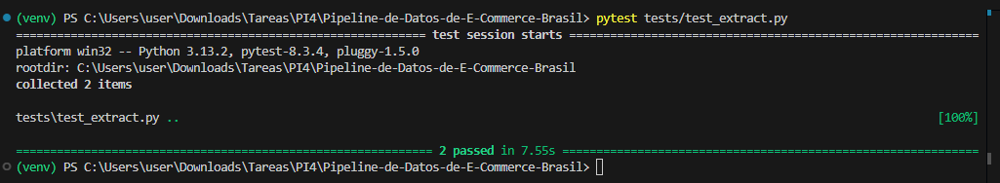
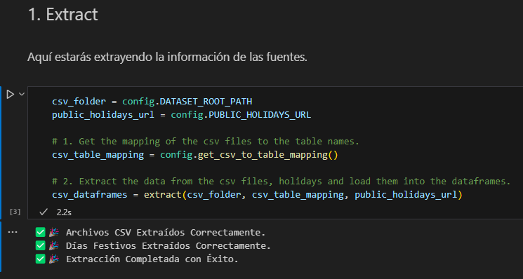
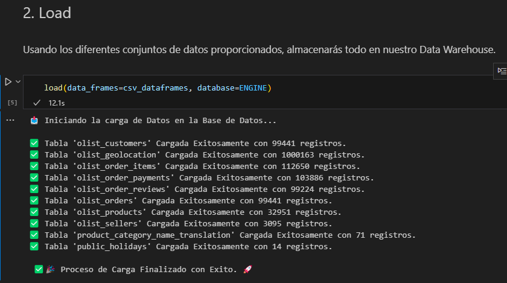
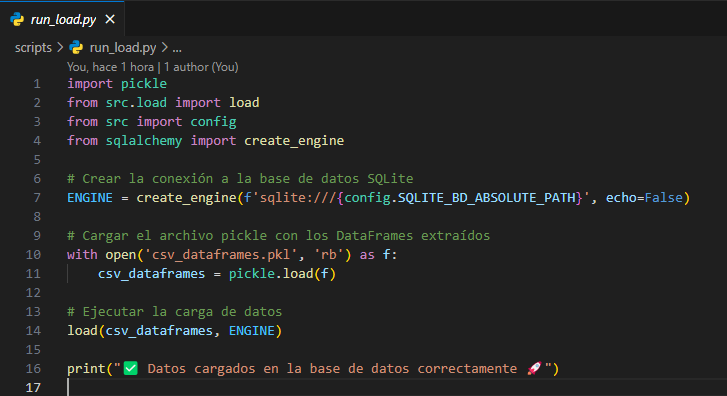
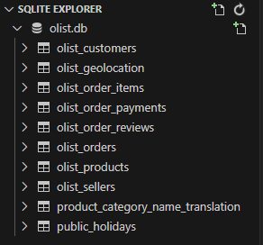
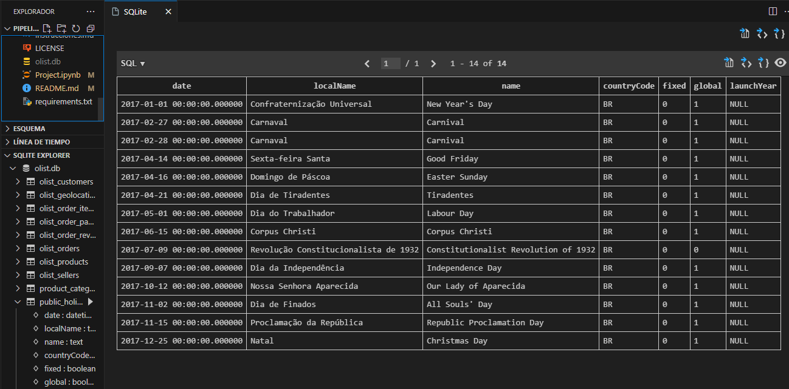
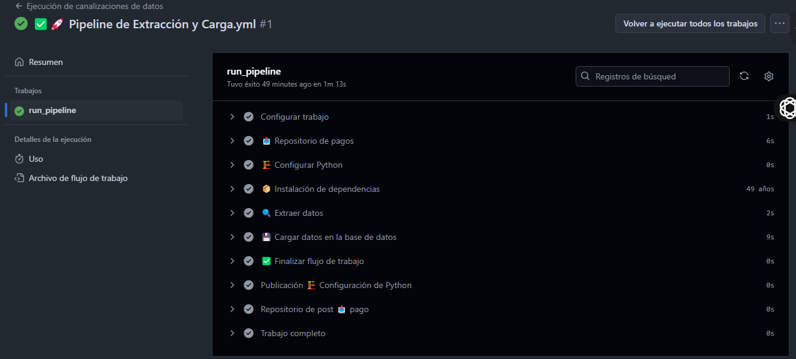

# 🚀 Proceso de Configuración, Validación y Ejecución del Proyecto  


💡 En este documento se detalla el paso a paso para la configuración del entorno, instalación de dependencias, validación y ejecución del flujo de trabajo.  

---

## ⚙️ Configuración del Entorno Virtual  

Para aislar las dependencias del proyecto, se crea un entorno virtual con **venv**:  

```console
py -m venv venv
```

🔹 **Activamos el entorno virtual** con el siguiente comando:  

```console
venv\Scripts\activate
```

📌 **Versión de Python utilizada:** **Python 3.13.2**  

---

## 📦 Instalación y Actualización de Dependencias  

📥 Instalamos todas las dependencias necesarias desde `requirements.txt`:  

```console
pip install -r requirements.txt
```

📢 **Actualizamos pip** a la última versión disponible:  

```console
python.exe -m pip install --upgrade pip
```

📜 **Guardamos la lista de librerías instaladas** en `requirements.txt`:  

```console
pip freeze > requirements.txt
```

---

# 📸 Evidencias del Proceso  

## ✅ 1. Validación del Test de Extracción  
🔍 Se valida la correcta extracción de los datos para asegurar que se obtienen correctamente.  
  

---

## 📂 2. Ejecución del Archivo de Extracción  
⚡ Se ejecuta el archivo de extracción para verificar su correcto funcionamiento. Se muestran mensajes de éxito ✅ o error ❌ según corresponda.  
  

---

## 🔄 3. Confirmación de la Ejecución  
📊 Se verifica que la ejecución se haya realizado correctamente mostrando mensajes de validación y resultados completos.  
  

---

## 🖥 4. Implementación de Script Adicional  
📜 Se implementa un script adicional para gestionar el flujo de trabajo mediante **GitHub Actions**, garantizando la automatización.  
  

---

## 🏗 5. Creación de la Base de Datos del Data Warehouse  
🛢 Se genera la base de datos del **Data Warehouse**, permitiendo almacenar y gestionar la información procesada de manera eficiente.  
  

---

## 📊 6. Visualización de Tablas en SQLite  
🔎 Se listan y verifican las tablas utilizando **SQLite**, asegurando que la estructura de los datos sea correcta.  
  

---

## ✅ 7. Validación del Flujo de Trabajo en GitHub Actions  
🚀 Se comprueba que el flujo de trabajo en **GitHub Actions** se ejecutó exitosamente, garantizando la automatización total del proceso.  
  
```